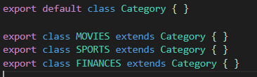

<h1>Notifier System - React, Express, Node, Radis</h1>

Fictional notification system that has the ability to receive a message and depending on the
category and subscribers, notify these users in the channels they are registered

Project saves all the information necessary to identify that the notification has been
sent correctly to the respective subscriber,such as the type of message, type of notification, user data, time, etc.

<h3>Users</h3>

Three users were pre-registered for different usage.

- Finance Notification will be send only to user "Foo", by SMS.

- Movies only by SMS to user "Bar" through.

- While "Baz" will receive Sports and Movies by E-mail and Push Notification.

  

<h3>Example of usage</h3>

Posting SPORTS section notification and as expected, only "BAZ" received. He got two notifications, E-mail and Push Notification.

<h3>Architecture</h3>

<h5>Database, Redis</h5>

Since It's a fictional purpose project. Lightweight and modern NoSQL database, Redis DB is not too simple as well as not so heavy to interfere in the process of development. 

<h5>Frontend, React</h5>

 It's a powerful Javascript platform that still reinventing itself, and continues one of the most relevant modern frontend platforms in we development.

<h5>Backend, Express+Node</h5> 

Minimalist enough as much It's powerful.  Both still one of the greatest combination for backend development.

<h5>Architecture/design pattern, MVC</h5>

Since in this project the "View" works completely in separated to the backend and the logic handling the data, and some of the data needs to be connected to others, makes sense to implement MVC for this case.  Probably some of the design patterns like builder and factory, would work but with a little mess when trying to connect different kinds of data. Keeping the logic in controllers by MVC, would make code cleaner.

<h5>Object-Oriented Programming and Functional Programming</h5> 

Since React.js works over Functional Programming concept, and Javascript is dynamically-typed and is not a class-based object-oriented language so doesn't have much features to keep a great level of SOLID's concepts in evidence by default like Java language, I implemented some concepts to make the code in the backend OOP as much as possible. 

Some evidences of implementation:

